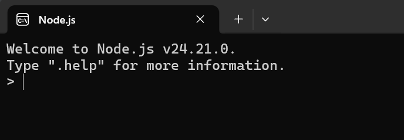
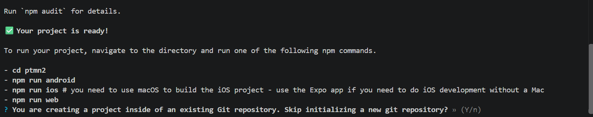
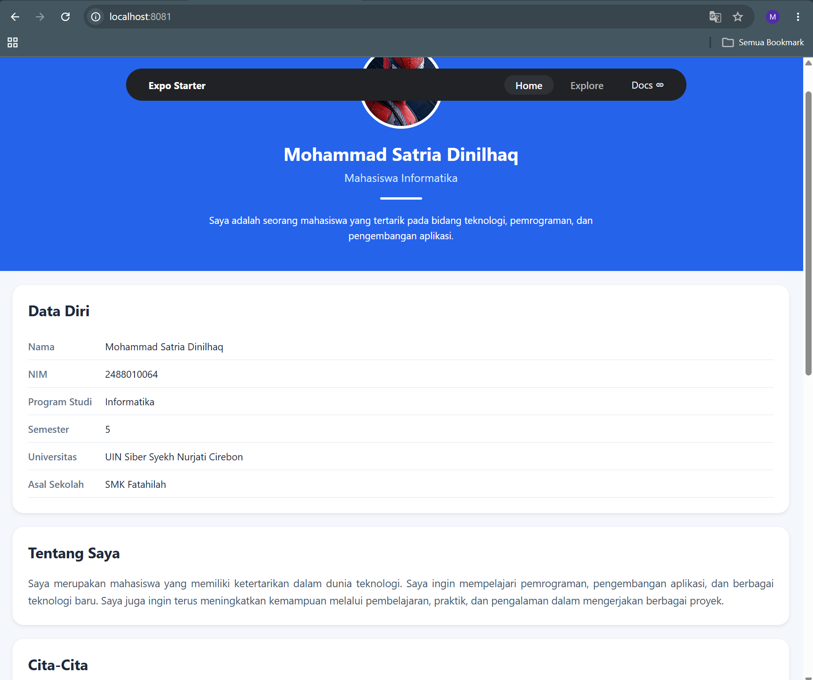

# Praktikum Menyiapkan dan Memulai Pemrograman Mobile (React Native)

### Tujuan Pembelajaran:

Mahasiswa mampu:

1. Menyiapkan dan Memulai Pemrograman Mobile (React Native)
2. Membuat Aplikasi Mobile (React Native)
3. Membuat CV sederhana dengan React Native

### MAteri Pembelajaran

1. Menyiapkan dan Memulai Pemrograman Mobile (React Native)

- Install Interpreter Node.JS
- download dan install node.js di alamat https://nodejs.org/en/download/
- Konfirmasi versi node.js
- node -v

  

- Konfirmasi versi npm
- npm -v

2. Membuat Aplikasi Mobile (React Native)

- Untuk Referensi Dokumentasi Resmi milik Expo
- https://docs.expo.dev/
- Untuk Referensi Dokumentasi Resmi milik React Native
- https://reactnative.dev/
- Memulai membuat Proyek baru dengan Framework Expo Go
- change directory ke folder praktikum (Pemrograman Mobile->Pertemuan-2)
- npx create-expo-app ptmn2 --template blank
- konfirmasi proyek baru
  

3. Menjalankan aplikasi mobile react native

- cd Pertemuan-2
- npx expo start
- install expo go via playstore
- install expo go via app store
- Buka dan scan QR Code via expo go
- running via web browser emulator
- ctrl+c untuk menghentikan server
- sebelumnya install (npx expo install react-dom react-native-web)
- npx expo start --web

4. Tugas Praktikum Pemrograman Mobile (React Native)

- Menambahkan CV sederhana dengan React Native
- Nama Lengkap
- NIM
- Asal Sekolah
- Cita-cita
- Rencana mencapai cita-cita

  
